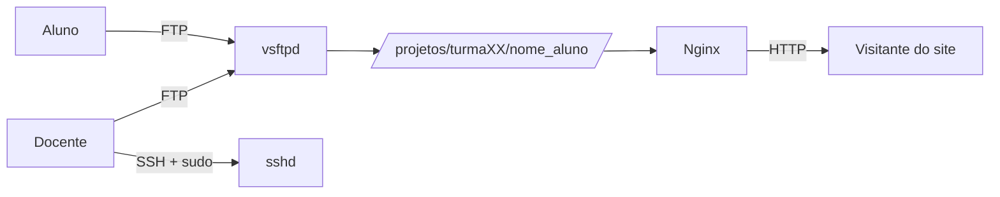

# VM para Hospedagem de Sites


Configuração de uma VM Debian para hospedagem de sites desenvolvidos por alunos, com envio de arquivos via FTP. Cada aluno possui um usuário isolado no sistema e uma URL pública sob o padrão `http://[IP]/turmaXX/nome_aluno/`.

O projeto é utilizado em contexto educacional, onde estudantes publicam seus projetos web ao longo do curso.

---

## Infraestrutura

- **Sistema Operacional:** Debian 13 (Trixie)
- **Hostname:** `vm-webserver`
- **Hypervisor:** Hyper-V
- **Servidor Web:** Nginx
- **Servidor FTP:** vsftpd
- **Diretório dos sites:** disco dedicado montado em `/projetos`

---

## Arquitetura



- Alunos enviam arquivos exclusivamente via FTP, isolados no próprio `HOME`.
- Docentes têm acesso SSH com `sudo` e acesso FTP para manutenção.
- Nginx serve os arquivos publicamente sob o caminho da turma e do aluno.

---

## Convenções

### Estrutura de diretórios

Os sites ficam organizados por turma, e dentro de cada turma por aluno:

```
/projetos/
├── turma01/
│   ├── nome_aluno_1/    ← HOME do aluno + raiz do site
│   ├── nome_aluno_2/
│   └── ...
├── turma02/
│   └── ...
```

O diretório do aluno é simultaneamente:

- O `HOME` do usuário Linux dele
- A raiz do site publicada pelo Nginx

Não há subdiretório `site/` ou `public/` intermediário.

### Nomenclatura de usuários

O login (Linux/FTP) é derivado do e-mail educacional, removendo o domínio e o ponto entre nome e sobrenome.

Exemplo:

| Aluno | E-mail | Login |
|---|---|---|
| Fulano da Silva | `fulano.dsilva@escola.edu.br` | `fulanodsilva` |

Esta convenção vale tanto para alunos quanto para docentes.

### Política de acesso

| Perfil | SSH | Shell | Sudo | FTP |
|---|---|---|---|---|
| Docente | ✅ | ✅ | ✅ | ✅ |
| Aluno | ❌ | ❌ (`/usr/sbin/nologin`) | ❌ | ✅ (chroot no próprio HOME) |

---

## Cookbook

Guias de instalação e configuração, na ordem recomendada de leitura:

1. [Configurar o Sistema Operacional](Cookbook/Configurar_Sistema_Operacional.md)
2. [Instalar e configurar o Nginx](Cookbook/Instalar_configurar_Nginx.md)
3. [Instalar e configurar o FTP](Cookbook/Instalar_configurar_FTP.md)
4. Gerenciar usuários Linux (docentes) — **[PENDENTE]**
5. Gerenciar usuários FTP (docentes e alunos) — **[PENDENTE]**

---

## Estado atual

- [x] Configuração do Sistema Operacional
- [x] Instalação e configuração do Nginx
- [x] Instalação e configuração do FTP (vsftpd)
- [ ] Configuração de TLS sobre FTP (FTPS) — planejado para etapa futura
- [ ] Guia de gerenciamento de usuários do Linux
- [ ] Guia de gerenciamento de usuários do FTP
- [ ] Scripts de automação para criação e remoção de contas de aluno

---

## Notas de design

- **FTP é o protocolo escolhido**, não SFTP. Sugestões de reestruturação para SFTP/jail não se aplicam a este projeto.
- O acesso dos alunos é confinado por `chroot` do vsftpd ao próprio `HOME`.
- ⚠️ **Nesta etapa o FTP está sem TLS.** As credenciais trafegam em texto claro. Uso restrito a rede confiável até a implementação do FTPS (ver "Estado atual").

---

## Autor

**Fernando Paes Dias** — Instrutor em cursos técnicos de Redes de Computadores e Manutenção e Suporte de Informática.

---
