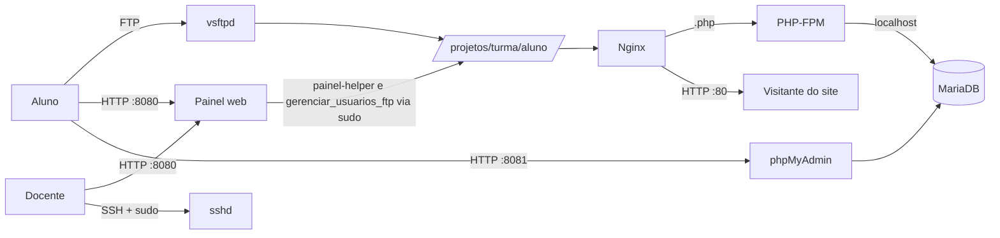

# VM para Hospedagem de Sites


Configuração de uma VM Debian para hospedagem de sites desenvolvidos por alunos. Cada aluno possui um usuário isolado no sistema e uma URL pública no padrão `http://[IP]/turma/aluno/`. Os arquivos podem ser enviados via FTP ou pelo painel web.

O projeto é utilizado em contexto educacional, onde estudantes publicam seus projetos web (HTML, CSS, JavaScript e PHP) ao longo do curso.

---

## Infraestrutura

- **Sistema Operacional:** Debian 13 (Trixie)
- **Hostname:** `vm-webserver`
- **Hypervisor:** Hyper-V
- **Servidor Web:** Nginx
- **PHP:** PHP-FPM 8.4, com `open_basedir` por aluno e fuso `America/Sao_Paulo`
- **Servidor FTP:** vsftpd
- **Banco de dados:** MariaDB, com um banco e um usuário por aluno, gerenciados pelo phpMyAdmin em `http://[IP]:8081/`
- **Painel web:** Flask + Gunicorn, em `http://[IP]:8080/_painel/`
- **Diretório dos sites:** disco dedicado montado em `/projetos`

---

## Arquitetura


```mermaid
flowchart LR
    Aluno[Aluno] -->|FTP| VSFTPD[vsftpd]
    Aluno -->|HTTP :8080| PAINEL[Painel web]
    Docente[Docente] -->|HTTP :8080| PAINEL
    Docente -->|SSH + sudo| SSHD[sshd]
    VSFTPD --> DIR[/projetos/turma/aluno/]
    PAINEL -->|painel-helper e gerenciar_usuarios_ftp via sudo| DIR
    DIR --> NGINX[Nginx]
    NGINX -->|.php| FPM[PHP-FPM]
    FPM -->|localhost| MARIADB[(MariaDB)]
    Aluno -->|HTTP :8081| PMA[phpMyAdmin]
    PMA --> MARIADB
    NGINX -->|HTTP :80| Visitante[Visitante do site]
```

- Alunos enviam arquivos via FTP ou pelo painel, isolados no próprio `HOME`.
- Docentes criam e removem contas pelo painel ou pelo script `gerenciar_usuarios_ftp.sh`, e têm acesso SSH com `sudo` para manutenção.
- O Nginx serve os sites na porta 80. O painel fica na porta 8080 e o phpMyAdmin na 8081, cada um em outra origem, para que os sites dos alunos não consigam usar a sessão deles.
- O MariaDB só aceita conexões da própria VM. O site PHP do aluno se conecta por `localhost`, e o aluno gerencia o banco pelo phpMyAdmin.

---

## Convenções

### Estrutura de diretórios

```
/projetos/
├── turma01/
│   ├── fulanodsilva/        ← HOME do aluno + raiz do site
│   │   ├── index.php
│   │   └── uploads/         ← única pasta onde o PHP pode gravar
│   └── cicranodsantos/
└── turma02/
    └── ...
```

O diretório do aluno é, ao mesmo tempo, o `HOME` do usuário Linux e a raiz do site publicada pelo Nginx.

### Permissões

| Caminho | Dono | Permissão | Motivo |
|---|---|---|---|
| `/projetos`, `/projetos/turma` | `root:www-data` | `751` | O aluno atravessa, mas não lista as pastas dos colegas |
| `/projetos/turma/aluno` | `aluno:www-data` | `2750` | O Nginx só lê; o setgid faz os arquivos herdarem o grupo `www-data` |
| `/projetos/turma/aluno/uploads` | `aluno:www-data` | `2770` | O PHP pode gravar; o Nginx não executa PHP aqui |

### Nomenclatura de usuários

O login (Linux, FTP e painel) é derivado do e-mail educacional, removendo o domínio e o ponto entre nome e sobrenome.

| Aluno | E-mail | Login |
|---|---|---|
| Fulano da Silva | `fulano.dsilva@escola.edu.br` | `fulanodsilva` |

Logins usam só letras minúsculas e números, começando por letra. Nomes de turma usam só letras e números.

### Política de acesso

| Perfil | SSH | Shell | Sudo | FTP | Painel web | Banco de dados |
|---|---|---|---|---|---|---|
| Docente | ✅ | ✅ | ✅ | ✅ | ✅ (senha própria do painel) | ✅ (`sudo mariadb`) |
| Aluno | ❌ | ❌ (`/bin/shell_ftp`) | ❌ | ✅ (chroot no próprio HOME) | ✅ (mesma senha do FTP) | ✅ (phpMyAdmin, só o próprio banco) |

Toda conta de aluno nasce com a senha `123@mudar`, e o painel obriga a troca no primeiro acesso.

### Banco de dados

| Item | Valor |
|---|---|
| Banco e usuário do banco | O login do aluno (`fulanodsilva`) |
| Permissões | Todas, somente no próprio banco |
| Senha inicial | `123@mudar`, independente da senha do FTP e do painel. O aluno a troca no phpMyAdmin. O botão "Redefinir senha" do painel volta as duas |
| Criação e remoção | Pelo `gerenciar_usuarios_ftp`, junto com a conta do aluno |

---

## Estrutura do repositório

```
.
├── README.md
├── .gitattributes                    Força quebra de linha LF (scripts e configurações)
├── Cookbook/                         Guias de instalação e o script de contas
│   ├── gerenciar_usuarios_ftp.sh
│   └── exemplo_arquivo.csv
├── config/                           Configuração dos serviços, copiada pronta
│   ├── nginx-projetos                → /etc/nginx/sites-available/projetos
│   ├── nginx-phpmyadmin              → /etc/nginx/sites-available/phpmyadmin
│   ├── php-hospedagem.ini            → /etc/php/8.4/fpm/conf.d/99-hospedagem.ini
│   ├── phpmyadmin.php                → /etc/phpmyadmin/conf.d/99-hospedagem.php
│   └── vsftpd.conf                   → /etc/vsftpd.conf
├── painel/                           Painel web (backend, helper, página e implantação)
│   ├── app.py
│   ├── painel-helper
│   ├── static/index.html
│   └── deploy/
└── exemplos/
    └── site-comemoracao/             Site PHP de teste, enviado pela conta de um aluno
```

---

## Como usar

> [!IMPORTANT]
> Os comandos dos guias alteram a configuração do sistema e precisam de privilégios de root.
> Execute os comandos como `root` ou use o `sudo`.

Clone o repositório na VM. Todos os guias executam os comandos a partir da raiz dele:

```bash
apt install -y git
git clone https://github.com/ferpaesdias/VM_Hospedagem_Sites.git
cd VM_Hospedagem_Sites
```

Depois, siga os guias do Cookbook na ordem abaixo.

---

## Cookbook

Guias de instalação e configuração, na ordem recomendada:

1. [Configurar o Sistema Operacional](Cookbook/Configurar_Sistema_Operacional.md)
2. [Instalar e configurar o Nginx e o PHP](Cookbook/Instalar_configurar_Nginx_PHP.md)
3. [Instalar e configurar o FTP](Cookbook/Instalar_configurar_FTP.md)
4. [Instalar e configurar o MariaDB e o phpMyAdmin](Cookbook/Instalar_configurar_MariaDB_phpMyAdmin.md)
5. [Gerenciar contas de alunos](Cookbook/Gerenciar_contas_de_alunos.md)
6. [Instalar e configurar o Painel Web](Cookbook/Instalar_configurar_Painel_Web.md)

---

## Estado atual

- [x] Configuração do Sistema Operacional
- [x] Instalação e configuração do Nginx
- [x] Instalação e configuração do FTP (vsftpd)
- [x] Suporte a PHP (PHP-FPM) com isolamento por aluno
- [x] Banco de dados MariaDB e phpMyAdmin, com um banco por aluno
- [x] Script de criação e remoção de contas de aluno (individual e CSV)
- [x] Painel web para docentes e alunos
- [ ] Configuração de TLS sobre FTP (FTPS)
- [ ] HTTPS no painel web e no phpMyAdmin
- [ ] Guia de gerenciamento de usuários Linux (docentes)

---

## Notas de design

- **FTP é o protocolo escolhido**, não SFTP. Sugestões de reestruturação para SFTP/jail não se aplicam a este projeto.
- O acesso dos alunos pelo FTP é confinado por `chroot` do vsftpd ao próprio `HOME`. No PHP, o isolamento é feito pelo `open_basedir`.
- A pasta `uploads/` é para **dados**, nunca para **código**: o PHP grava nela, mas o Nginx não executa `.php` ali.
- O phpMyAdmin fica em porta própria (8081) e no endereço `/_phpmyadmin/`, como o painel: a porta separa a origem dos sites dos alunos e o endereço faz o cookie de sessão nunca chegar a eles.
- Cada aluno só acessa o próprio banco (`GRANT` somente nele). O MariaDB escuta apenas em `127.0.0.1`, e o `root` não entra pelo phpMyAdmin.
- ⚠️ **O FTP, o painel e o phpMyAdmin ainda não usam TLS.** As senhas trafegam em texto claro. Uso restrito a rede confiável até a implementação do FTPS e do HTTPS.

---

## Autor

**Fernando Paes Dias** — Instrutor em cursos técnicos de Redes de Computadores e Manutenção e Suporte de Informática.

---